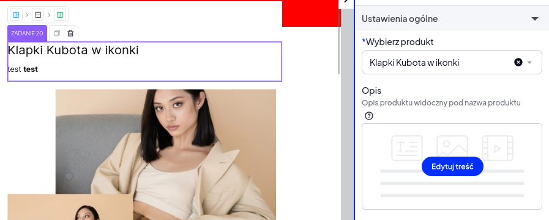

# Zadanie 20

1. Stwórz moduł własny na sklepie, a następnie poniżej w sekcji Rozwiązanie wpisz nazwę modułu oraz link do strony sklepu na którym ten moduł został umieszczony.
2. Moduł powinien mieć: TWIG oraz konfiguracje.
3. Utwórz moduł który będzie miał w swojej konfiguracji kontrolkę [ProductSelector](https://storefront.developers.shoper.pl/sve/elements/product-selector/) oraz [WYSIWYG](https://storefront.developers.shoper.pl/sve/elements/wysiwyg/).
4. W twig powinno się wyświetlić w `<h1>` nazwa wybranego produktu.
5. W `
` należy wyświetlić opis produktu z `WYSIWYG`. Po podaniu w tym polu w `SVE` kodu `HTML` powinien on zostać poprawnie wyrenderowany na stronie.
6. Kontrolka WYSIWYG powinna zawierać [hint](https://storefront.developers.shoper.pl/sve/configuration/#hint) o treści "Jak pisać dobre opisy produktów?" z linkiem do strony: https://www.shoper.pl/learn/artykul/jak-pisac-dobre-opisy-produktow-w-sklepie-internetowym.
7. Kontrolka WYSIWYG powinna zawierać [labelDescription](https://storefront.developers.shoper.pl/sve/configuration/#labeldescription) o treści "Opis produktu widoczny pod nazwą produktu".

## Rozwiązanie:

Nazwa modułu: "Produkt z dedykowanym opisem (Z20)"
Link do sklepu z umieszczonym modułem: [Link](https://websiteverything.site/blog_kategoria)