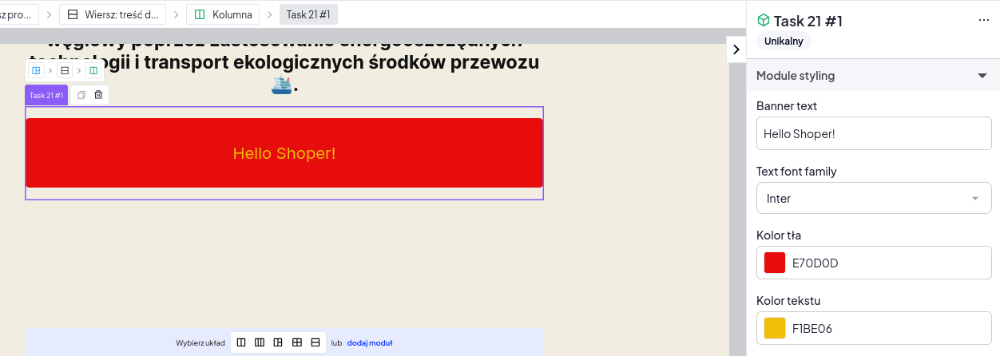

# Zadanie 21

1. Stwórz moduł własny na sklepie, a następnie poniżej w sekcji Rozwiązanie wpisz nazwę modułu oraz link do strony sklepu na którym ten moduł został umieszczony.
2. Moduł powinien mieć: TWIG oraz konfiguracje.
3. Utwórz moduł który będzie miał w swojej konfiguracji kontrolkę [FontFace](https://storefront.developers.shoper.pl/sve/elements/font-face/), 2x [ColorPicker](https://storefront.developers.shoper.pl/sve/elements/color-picker/) oraz [Text](https://storefront.developers.shoper.pl/sve/elements/text/).
4. `FontFace` - decyduje jaki typ czcionki będzie miał wyświetlony tekst z kontrolki `Text`.
5. Jeden `ColorPicker` odpowiadać powinien za kolor tła dla modułu.
6. Drugi `ColorPicker` odpowiadać powinien za kolor tekstu.

## Rozwiązanie:

Nazwa modułu: ...
Link do sklepu z umieszczonym modułem: ...